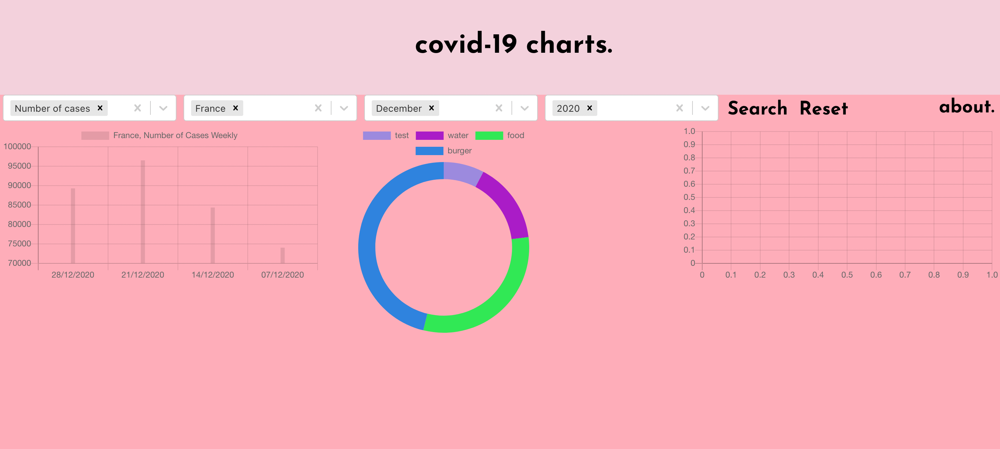

# Project dashboards

This project was bootstrapped with [Create React App](https://github.com/facebook/create-react-app).

In the project directory, you can run:

### `npm start`

## about the project.
This project was build with React.JS and Chart.JS in order to practice.
In order to do so and to build something both interesting and meaningful I downloaded the covid-19 data from this website: 
 https://www.ecdc.europa.eu/en/publications-data/download-todays-data-geographic-distribution-covid-19-cases-worldwide
Next I decided to focus on building the filters which could allow potential users to for example: compare the amount of weekly cases in different months between different countries. 

At this point, I am still working on filters: so far user is able to see the data in one country, during one month and in form of a barchart. 

The next steps are: 
- working on filters so user is able to filter data not per one country but as many as they please
- finding a way to feed the data to bubble chart and doughnut
- making visualisation in barchat more easy to read
- updating 'about' mini page

So far the dashboard look like this: 




I found this articles quite useful for learning about how Chart.JS works with React -
https://blog.bitsrc.io/customizing-chart-js-in-react-2199fa81530a
https://www.educative.io/edpresso/how-to-use-chartjs-to-create-charts-in-react
https://tobiasahlin.com/blog/chartjs-charts-to-get-you-started/#1-bar-chart


- Icons:
- Cross by Aybige from the Noun Project

example of JSON file:
```json 
{
"dateRep" : "11/01/2021",
"year_week" : "2021-01",
"cases_weekly" : 675,
"deaths_weekly" : 71,
"countriesAndTerritories" : "Afghanistan",
"geoId" : "AF",
"countryterritoryCode" : "AFG",
"popData2019" : 38041757,
"continentExp" : "Asia",
"notification_rate_per_100000_population_14-days" : "4.15"
},
```
